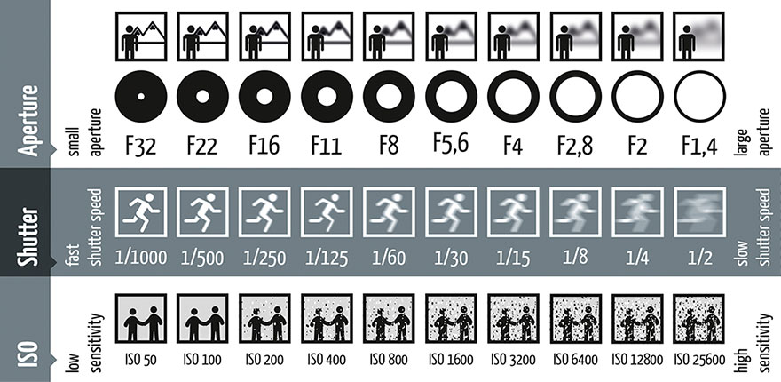

## 光圈 Aperture
最直观的表现就是画面的虚化程度。
F1.2就是大光圈，进光量就会越多，画面越亮；虚化非常明显。
F16就是小光圈。几乎无虚化

## 快门速度 Shutter Speed

1/4000秒，相机的进光量就会很小，画面会很黑暗；
快门速度越慢，比如30秒，相机的进光量就会很多，画面就会非常明亮。

## 感光度 ISO

低ISO可以保证画面干净、低噪点，比如ISO 100、ISO 200；
高质量的照片，使用三脚架

高ISO会让画面噪点增加，具体增加多少要看ISO的数值有多高和相机控噪能力双方面影响，比如ISO 3200、ISO 6400。

