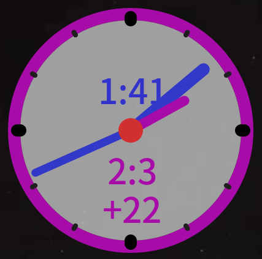

# Timer

集合`定时器`和`闹钟⏰`功能。
> 以前经常使用at脚本设置提醒，每次还要开终端，输入命令。这个单一执行文件，可以解决一般性的定时问题。

GPL3 授权。

## 鼠标操作

* 红色圆心部分：
    * `1`键切换提醒开关，时间文字和定时指针会变颜色，指示开关的状态。
    * 滚轮设置以当前时间为基础，设置定时。正向定时，会显示"+10"分钟这样的状态。
    * 其他鼠标按钮，关闭软件。
* 其他界面部分：
    * `1`拖动。
    * 滚轮缩放。
    * 其他鼠标按钮，点选定时，以五分钟为间隔。

## 提醒动作
* 缺省执行`/usr/bin/canberra-gtk-play -l 5 -i complete`，就是系统声音，连续响5次。如果不关闭提醒，大约会响一分钟。
* 如果有自定义脚本，`~/.config/time.script`，提醒动作就会执行它。不管shell格式。

> 软件10秒激活一次，所以最大延时误差是10秒。

>虽然界面丑点，其实只是为了不调用任何外部资源。